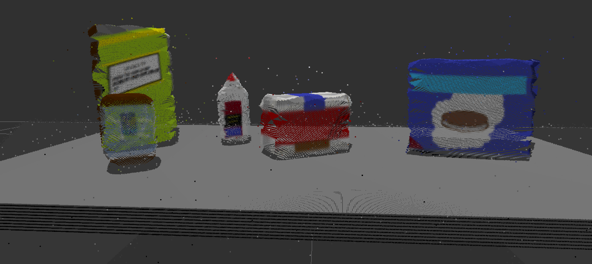
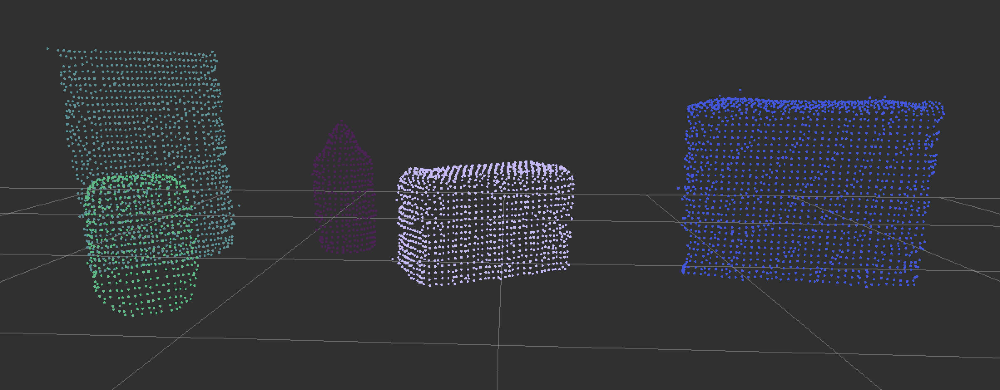
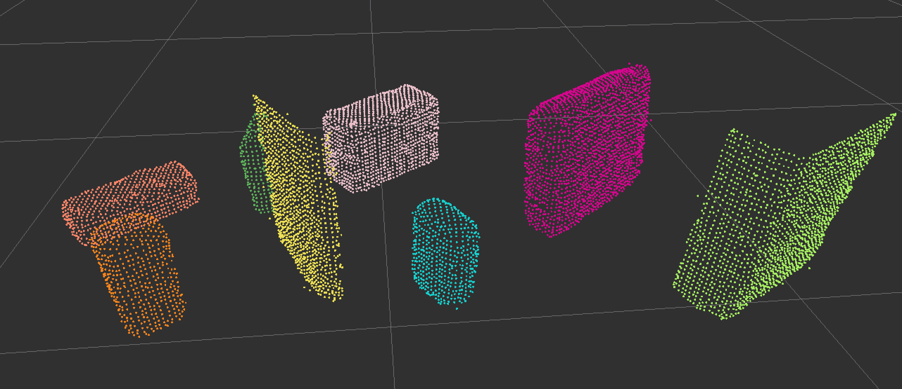
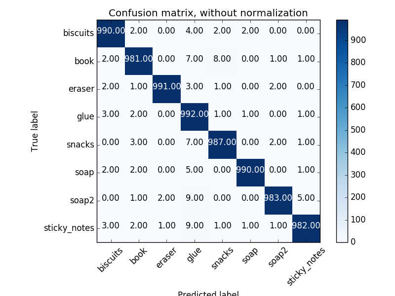
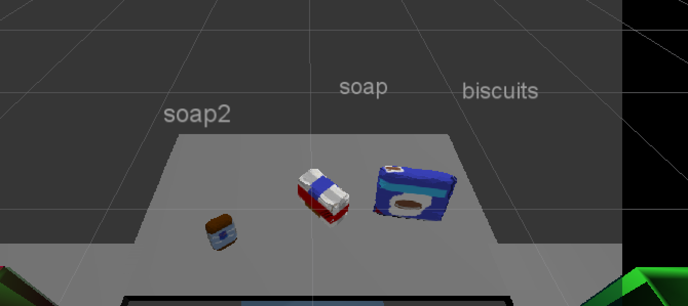
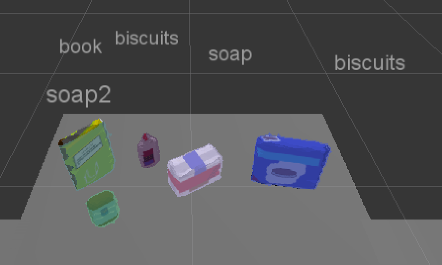
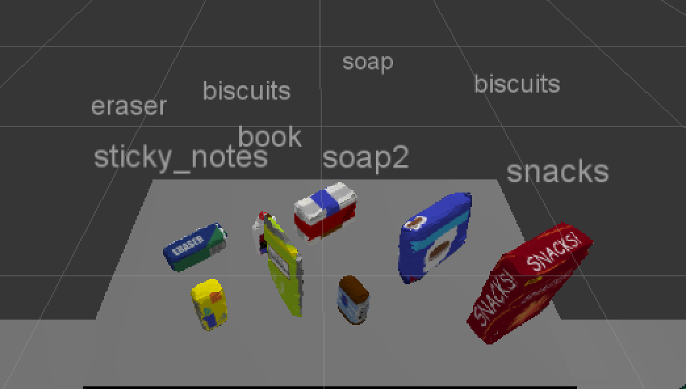

# 3D Perception

Implementation of 3D perception pipeline for a simulated PR-2 robot with RGB-D camera with sensor noise and lens distortion. Filtering, object segmentation, object recognition, and pose estimation techniques are applied to allow the PR-2 to pick up target objects in a cluttered environment. 

## Perception Pipeline

### Filtering

The filtering process involves several steps to go from the point cloud received by the RGB-D camera, to the filtered point cloud that is used for object recognition:

Original:

Filtered:

#### Outlier Removal Filter

Noise due to external factors such as dust, humidity, or the presence of various light sources can lead to sparse outliers which corrupt the results. Such outliers lead to complications in the estimation of point cloud characteristics like curvature, gradietns, etc. leading to erroneous values, which in turn might cause failures at various stages in our perception pipeline. Performing a statistical analysis in  the neighborhood of each point allows us to remove such outliers. PCL's StatisticalOutlierRemoval filter performs such filtering by computing the distance from each point to its nieghbors and calculating a mean distance. By assuming a Gaussian distibution, all points whose mean distances are outside of an interval are considered to be outliers and removed from the point cloud (project_template.py lines 60-72)

#### VoxelGrid Downsampling

RGB-D cameras provide feature rich and particularly dense point clouds, meaning more points are packed in per unit volume than, for example, a Lidar point cloud. Running computation on a full resolution point cloud can be slow and may not yield any improvement on results obtained using a more sparsely sampled point cloud. So, in many cases, it is advantageous to downsample the data. In particular, VoxelGrid Downsampling Filter is useful to derive a point cloud that has fewer points but still does a good job of representing the input point cloud as a whole. (project_template.py lines 76-85)

#### Pass Through Filtering

Given prior information about the location of your target in the scene, a Pass Through Filter can remove useless data in the point cloud. Defining this region of interest allows us remove everything but the table and target objects. (project_template.py lines 90-100)

#### RANSAC

The RANSAC (Random Sample Consensus) algorithm allows us to identity points in the point cloud that belond to a particular model. It assumes all of that data in the dataset is composed of both inliers and outliers, where inliers can be defined by a particular model with a specific set of parameters, while outliers do not fit that model and can be discarded. By modeling the table top as a plane, we can remove it from our scene, leaving just the target objects. The PCL library implementation allows us to extract the indices of both the inliers (table top) and outliers (everything else i.e. our target objects) (project_template.py lines 105-120)

### Cluster Segmentation

#### Euclidean Clustering

Using the PCL library function called EuclideanClusterExtraction() allow us to perform a DBSCAN cluster search on the 3D point cloud. THis algorithm does a good job of segmenting individual objects with no prior knowledge of what shape the objects may be, or how many objects may be in the scene. There are 3 parameters to set that define the maximum distance between points in a cluster, and the minimum and maximum cluster size. (project_template.py lines 123-136)

### Object recognition 

#### Feature Extraction

After cluster segmenting the target objects, the next step is to identify each cluster object as one of our target objects. Becuase these objects can vary in shape, size, distance, orientation, and obscured by other objects, we will train a Support Vector Machine (SVM) classifer to identify the HSV and surface normal features of our target objects. Compared to the RGB color space, HSV is less sensitive to changes in lighting. By binning the HSV values into a histogram, we can more easily use them to train our SVM classifier. Surface normals are unit vectors perpendicular to the surface of an object, and the distribution of surface normals can be used to describe the shape of an object. Binning the distribution of surface normals into a histogram allows us to train our SVM on these features.
(histograms generated in features.py, histograms used in project_template.py lines 177-180)

#### SVM

Support Vector Machines are supervised machine learning algorithms that allows you to characterize the parameter space of your dataset into discrete classes. SVMs work by applying an iterative method to a training dataset, where each item in the training set is characterized by a feature vector and a label. 

A training set of feautres was generated for the objects in the pick_list_x.yaml files in /pr2-robot/config. Each pick list corresponds to a world and thus indicates what items will be present in that scenario. The training set was generated by running the capture_features.py script. Each object model had 1,000 training instances. After training a linear SVM on my HSV and surface normal features, the following confusion matrices were generated for our target objects:

 

The trained SVM model is used to recognize objects from our clusters (project_template.py lines 170-186)

## Pick and Place Setup

In the 3 test scenarios, there is a yaml file of pick list of objects for the PR-2 to identify and pick up in a given order. For each scenario, a yaml file is created that saves PickPlace requests for the PR-2 robot to execute. The yaml files include the following information (these properties are generated in project_template.py on lines 218-269):
  - test_scene_num: the test scene being used (1,2,3)
  - object_name: name of object, obtained from picklist
  - arm_name: name of the arm that PR-2 should use to pick up the object (dependent on the which dropbox the object should be placed into)
  - pick_pose: calculated Pose of the recognized object's centroid
  - place_pose: Pose position of where PR-2 should place the object (either left or right dropbox)

## Results and Analysis

3/3 Objects Recognized correctly in test1.world:

4/5 Objects Recognized correctly in test2.world:

6/8 Objects Recognized correctly in test3.world:

